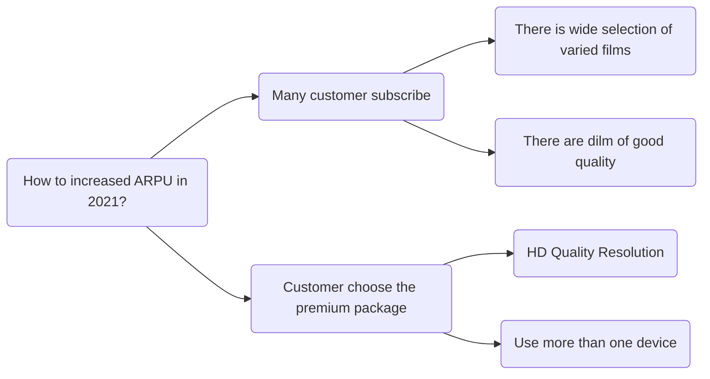

# Netflix-Movies-and-TV-Shows

Tools:   

Business Overview: 

Issue Tree:

```mermaid
graph LR
    A(How to increased ARPU in 2021?)  --> B(Many customer subscribe)
    A --> C(Customer choose the premium package)
    B --> D(There is wide selection of varied films) & E(There are dilm of good quality)
    C --> F(HD Quality Resolution) & G(Use more than one device)
```
