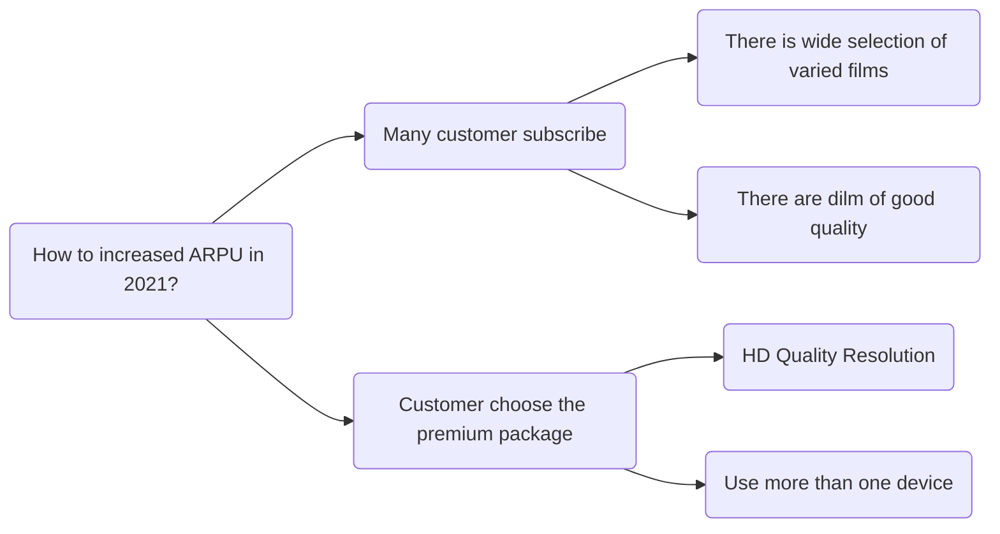

# Netflix-Movies-and-TV-Shows Visualization
Visualization: [Power BI](https://app.powerbi.com/view?r=eyJrIjoiZWI4N2IzZDItZTY1Yy00NDAyLWI2ZmItODE3MjdmOGRiZjg0IiwidCI6ImQ3Yjk1ZWM0LTlhN2YtNDI2MC1iMmUzLWViNTNmMGFjODQwMSIsImMiOjEwfQ%3D%3D)

Netflix is one of the most popular media and video streaming platforms. They have over 8000 movies or tv shows available on their platform, as of mid-2021, they have over 200M Subscribers globally. Netflix's revenue primarily comes from subscription fees. The company has seen consistent revenue growth driven by an increasing subscriber base and higher subscription prices.

Issue Tree:

